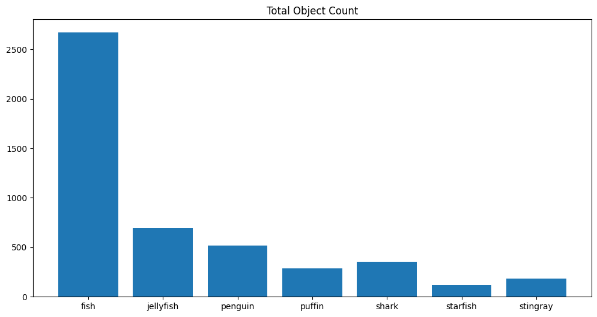
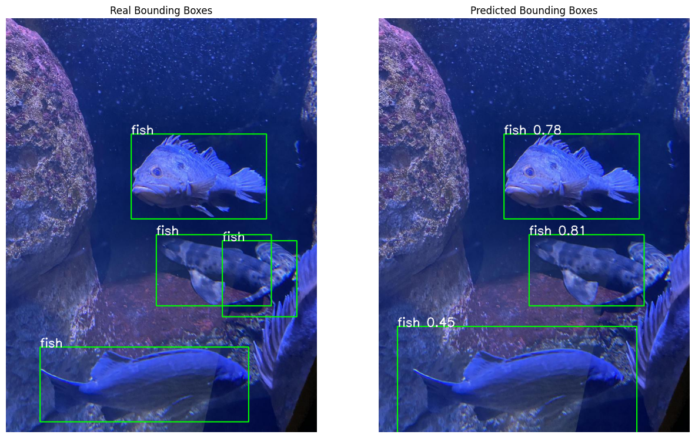

# Underwater-Object-Detection

- [Underwater-Object-Detection](#underwater-object-detection)
  - [Introduction](#introduction)
  - [Dataset](#dataset)
  - [EDA (Exploratory Data Analysis)](#eda-exploratory-data-analysis)
  - [Preprocessing](#preprocessing)
  - [Data Augmentation](#data-augmentation)
  - [Model](#model)
    - [Transfer Learning](#transfer-learning)
    - [Hyperparameter Tuning](#hyperparameter-tuning)
    - [OHEM](#ohem)
    - [GIOU Loss](#giou-loss)
    - [Soft-NMS](#soft-nms)
    - [Implementation](#implementation)
  - [Results](#results)
    - [Loss and Metrics](#loss-and-metrics)
    - [Output](#output)
  - [Conclusion](#conclusion)
  - [Contributors](#contributors)

## Introduction

Object detection is a computer vision task that involves both localizing objects in images and classifying them. Faster R-CNN is a popular deep learning model for object detection that is an evolution of the R-CNN and Fast R-CNN models. Faster R-CNN is composed of two modules: a region proposal network (RPN) that generates region proposals and a network that uses these proposals to detect objects. You can learn more about this network [here](https://arxiv.org/abs/1506.01497). The architecture used in this notebook is based on [this paper](https://www.researchgate.net/publication/368708716_Underwater_Object_Detection_Method_Based_on_Improved_Faster_RCNN).

## Dataset

The dataset used in this notebook is the [Underwater Object Detection Dataset](https://www.kaggle.com/datasets/slavkoprytula/aquarium-data-cots/data). This dataset contains images of underwater scenes with objects such as fish, jellyfish, and more. The dataset is divided into training and validation sets, and each image is labeled with the class of the object and the bounding box coordinates of the object in the image. The dataset is in the COCO format, which is a popular format for object detection datasets. You can learn more about the COCO format [here](https://cocodataset.org/#format-data). The classes in the dataset are as follows:

- fish
- jellyfish
- penguin
- puffin
- shark
- starfish
- stingray

## EDA (Exploratory Data Analysis)

In order to design a good model, we need to understand the data we are working with. This involves exploring the dataset to understand its structure, the distribution of the classes, and the characteristics of the images. We will use some techniques to visualize the data, such as plotting the images and bounding boxes, and analyzing the distribution of the classes.

At first we look at the distribution of the classes in the dataset. We can see that the classes are imbalanced, with some classes having more examples than others. This can be a challenge for the model to learn from the data and produce accurate detections. We will use some techniques to address this issue, such as data augmentation and hyperparameter tuning.

To mitigate the class imbalance, we can use techniques such as data augmentation and hyperparameter tuning and OHEM (all of which will be discussed later).

Another important aspect is number of objects per image. We can see that most images contain one object, but there are also images with multiple objects. This can be a challenge for the model to learn from the data and produce accurate detections.

Now we want to see the distribution of the bounding box sizes in the dataset. We can see that the bounding boxes have different sizes and aspect ratios, which can be a challenge for the model to learn from the data and produce accurate detections.

Finally, we want to visualize the images and bounding boxes in the dataset. We can see that the images contain objects such as fish, jellyfish, and more, and the bounding boxes are annotated with the class of the object and the coordinates of the box. This can help us understand the characteristics of the images and the objects in the dataset.

## Preprocessing

Before training the model, we need to preprocess the data to prepare it for training. This involves loading the images and labels, resizing the images, normalizing the pixel values.

## Data Augmentation

For data augmentation, we will use the following techniques:

- Random Horizontal Flip: This technique flips the image horizontally with a probability of 0.5. This can help the model learn from the data and produce more accurate detections.
- Random Vertical Flip: This technique flips the image vertically with a probability of 0.5. This can help the model learn from the data and produce more accurate detections.
- Random Rotation: This technique rotates the image by a random angle between -10 and 10 degrees. This can help the model learn from the data and produce more accurate detections.
- Random Brightness: This technique changes the brightness of the image by a random factor between 0.5 and 1.5. This can help the model learn from the data and produce more accurate detections.
- Random Rescale: This technique rescales the image by a random factor between 0.5 and 2.0. This can help the model learn from the data and produce more accurate detections.
- Mosaic Augmentation: This technique combines four images into a single image by randomly cropping and scaling the images. This can help the model learn from the data and produce more accurate detections. A sample of the mosaic augmentation is shown below.

## Model

We will use some techniques to improve the performance of the model, such as data augmentation, transfer learning, and hyperparameter tuning, OHEM, GIOU loss, and Soft-NMS.

### Transfer Learning

Transfer learning is a technique that allows you to use a pre-trained model as a starting point for training a new model on a different task. This can help you achieve better performance with less data and computational resources. For object detection tasks, you can use a pre-trained model as a backbone to extract features from the input images and then add new heads for classification and regression. This can help you learn from the data and produce more accurate detections.

### Hyperparameter Tuning

Hyperparameter tuning is the process of finding the best set of hyperparameters for a machine learning model. This can help you improve the performance of the model and reduce the risk of overfitting. For object detection tasks, you can tune hyperparameters such as the learning rate, batch size, and number of epochs. This can help you learn from the data and produce more accurate detections.

### OHEM

Online Hard Example Mining (OHEM) is a technique used to focus the training process on the most challenging examples in the dataset. This can help the model learn from its mistakes and improve its performance.

### GIOU Loss

Generalized Intersection over Union (GIOU) is a loss function used to measure the similarity between two bounding boxes. This loss function can help the model learn to predict more accurate bounding boxes.

GIOU is defined as follows:

$$
GIOU = IOU - \frac{C - U}{C}
$$

Where:

- `IOU` is the Intersection over Union between the predicted and ground truth bounding boxes.
- `C` is the smallest convex set that contains both the predicted and ground truth bounding boxes.
- `U` is the area of the smallest convex set that contains both the predicted and ground truth bounding boxes.

### Soft-NMS

Soft Non-Maximum Suppression (Soft-NMS) is a technique used to suppress overlapping bounding boxes by reducing the confidence scores of nearby boxes. This can help the model produce more accurate detections.

$$
\text{Soft-NMS} = \begin{cases}
\text{score} \times \exp\left(-\frac{(IOU)^2}{\sigma}\right) & \text{if } IOU > \text{threshold} \\
\text{score} & \text{otherwise}
\end{cases}
$$

Where:

- `score` is the confidence score of the bounding box.
- `IOU` is the Intersection over Union between the predicted and ground truth bounding boxes.
- `threshold` is the threshold above which the scores are suppressed.
- `sigma` is a parameter that controls the rate at which the scores are suppressed.

### Implementation

And then we will create the Faster R-CNN model using the PyTorch library. We will use a pre-trained ResNet-101 backbone and replace the classification and regression heads with new heads for our dataset. We will also define the loss function and optimizer for training the model.

RCNN model is defined with the following components:

- **Backbone**: A pre-trained ResNet-101 backbone is used to extract features from the input images.
- **Region Proposal Network (RPN)**: A region proposal network is used to generate region proposals for objects in the images.
- **RoI Pooling**: RoI pooling is used to extract features from the region proposals and resize them to a fixed size.
- **Head**: The head of the model consists of two subnetworks: a classification subnetwork that predicts the class of the object in the region proposal and a regression subnetwork that predicts the bounding box coordinates of the object.
- **Loss Function**: The loss function used to train the model is a combination of the classification and regression losses.
- **Optimizer**: The SGD optimizer is used to optimize the model parameters during training.
- **Learning Rate Scheduler**: A learning rate scheduler is used to adjust the learning rate during training.

## Results

### Loss and Metrics

After training the model, we can evaluate its performance on the validation set. We can calculate metrics such as the mean Average Precision (mAP) and the mean Average Recall (mAR) to measure the performance of the model. We can also visualize the detections made by the model on the validation images to see how well it is performing.

### Output

Finally, we can use the model to make predictions on new images and visualize the detections made by the model. We can see that the model is able to detect objects such as fish, jellyfish, and more in the images and produce accurate bounding boxes.

## Conclusion

In this notebook, we have implemented a Faster R-CNN model for underwater object detection using the PyTorch library. We have used techniques such as transfer learning, hyperparameter tuning, OHEM, GIOU loss, and Soft-NMS to improve the performance of the model. We have trained the model on the Underwater Object Detection Dataset and evaluated its performance on the validation set. We have visualized the detections made by the model on the validation images and made predictions on new images. The model is able to detect objects such as fish, jellyfish, and more in the images and produce accurate bounding boxes. This notebook can serve as a starting point for building object detection models for other datasets and tasks.

## Contributors

- [Matin Bazrafshan](https://github.com/FabulousMatin)
- [Shahriar Attar](https://github.com/Shahriar-0)